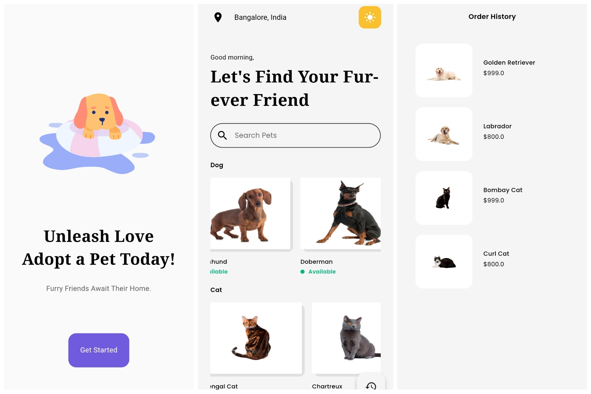

# Pet Store made in Flutter

## Download for Android [APK](https://drive.google.com/file/d/1T5OE-3JLM5__YOM2rVAd7pVTqIxjMINP/view?usp=drive_link)

# Intoduction

- Used Provider Library to hande all the state management.
- To keep the state changes persistent (Even after unistalling) SharedPreferences is used and direclty integrated into provider code.
- Usage of MVC Architecture to seprate the UI, data and Buisness logic.

# Features

- Dark and Light Mode support with toggle button.
- Hero Animation to keep user focus on the subject.
- Confetti animations on Adoption.
- Storing Order History.
- Cute animation in the Intro Screen using Lottie Library.
- UUID generation for all the new Models using UUID Library.
- Ability to click on the image to zoom using Zoom Widget.
- Quick search functionality and immediate ui response.
- Persitent Data across app launched.

# Testing

- Widget Testing has been done for a two widgets one using a custom model and other just a basic text assertion.

  
